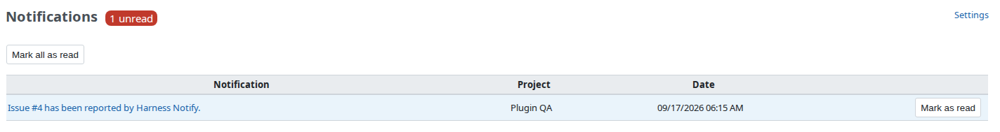
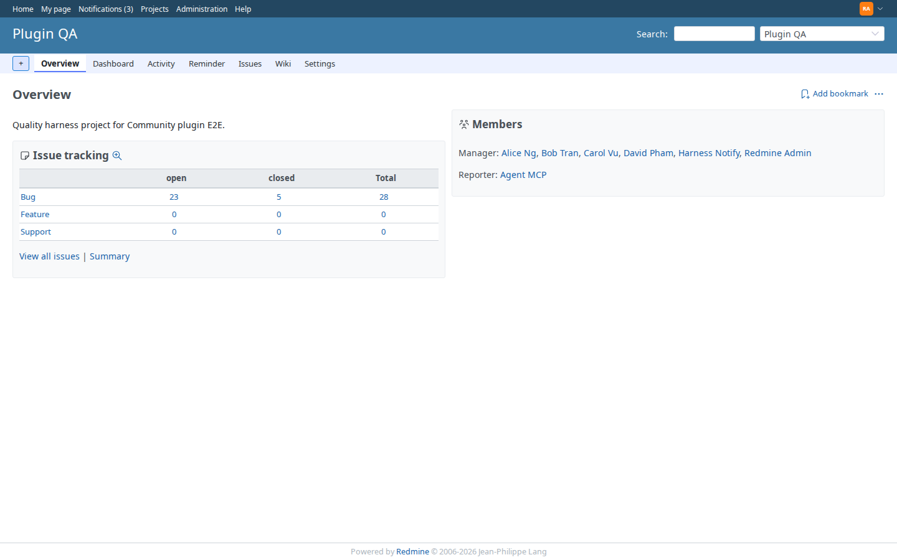
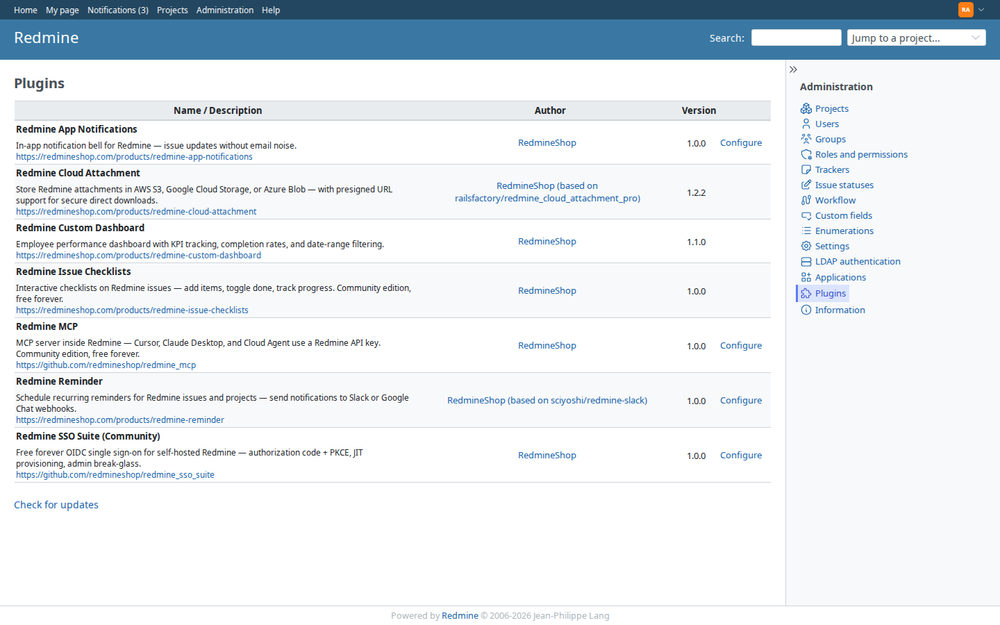
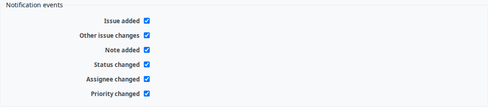

# Redmine App Notifications

[](https://redmineshop.com/products/redmine-app-notifications)
[](LICENSE)
[](https://github.com/redmineshop/redmine_app_notifications/actions/workflows/ci.yml)

**Last maintained:** 2026-09-22

**Source on GitHub:** [github.com/redmineshop/redmine_app_notifications](https://github.com/redmineshop/redmine_app_notifications)

In-app Notifications menu for Redmine.

In-app notification feed for Redmine — issue activity appears in a **Notifications** top-menu entry with an unread count, so users can catch up without living in email.

Community edition is free — no license key and no phone-home. Clone from this repository.

## Features

- **Notifications** entry in the Redmine top menu with unread count
- In-app feed for issue create / update / note / status / assignee / priority (configurable)
- Mark individual or all notifications as read
- Per-user toggle under **My account**
- Optional email fallback via cron rake task (admin setting)
- Admin settings use standard Redmine tabular forms
- No Faye or other external realtime services required

## Requirements

- Redmine 5.0.x or 6.x (`requires_redmine version_or_higher: '5.0'`)
- Ruby 3.0+
- MySQL 8 or PostgreSQL
- A plugin migration (`app_notifications` table)

## Installation

**Estimated time: 10 minutes.**

Clone into `plugins/redmine_app_notifications` in your Redmine install (folder name must match):

```bash
cd /path/to/redmine/plugins
git clone https://github.com/redmineshop/redmine_app_notifications.git
ls redmine_app_notifications/init.rb
```

Do not rename the plugin directory. If you download a GitHub ZIP, rename the unpacked `redmine_app_notifications-main` folder to `redmine_app_notifications`.

### Migrate and restart

```bash
cd /path/to/redmine
RAILS_ENV=production bundle exec rake redmine:plugins:migrate NAME=redmine_app_notifications
# then restart Redmine (systemd, Puma, or docker compose restart)
```

Docker:

```bash
docker exec -e RAILS_ENV=production YOUR_REDMINE_CONTAINER \
  bundle exec rake redmine:plugins:migrate NAME=redmine_app_notifications
docker restart YOUR_REDMINE_CONTAINER
```

No extra gems.

### Enable per user

Users can enable or disable in-app notifications under **My account** (preferences). The default is **on**.

See the [Community install guide](https://redmineshop.com/docs/install) for Docker notes shared with the other free plugins.

## Configuration

**Administration → Plugins → Redmine App Notifications → Configure**

- **Notification events** — enable/disable in-app notifications per event:
  - Issue added
  - Issue updated (other changes)
  - Issue note added
  - Issue status updated
  - Assignee updated
  - Priority updated
- **Enable email fallback** — when on, run periodically:

```bash
bundle exec rake redmine:app_notifications:email_fallback RAILS_ENV=production
```

This emails unread in-app items older than 24 hours, one plain-text digest per recipient. Rows stay unread, so a later run includes them again until someone marks them read. Recipients who can no longer see the issue are skipped. MiniTest covers that rake behavior. Playwright does not.

## Uninstall

```bash
cd /path/to/redmine
RAILS_ENV=production bundle exec rake redmine:plugins:migrate NAME=redmine_app_notifications VERSION=0
```

Remove `plugins/redmine_app_notifications` and restart Redmine. Rolling back the migration **deletes all in-app notification rows**.

## Compatibility

Declared follows `requires_redmine version_or_higher: '5.0'` for 5.x and 6.x. Redmine 7.0 is not a claimed target. Tested means a run pinned to that Redmine line. The demo image is official `redmine:latest` (tag not pinned), so a demo boot is not a pass for a specific row.

| Redmine | Declared | Tested |
|---------|----------|--------|
| 5.0.x   | Yes      | No — unverified |
| 5.1.x   | Yes      | No — unverified |
| 6.0.x   | Yes      | No — unverified |
| 6.1.x   | Yes      | No — unverified |
| 7.0.x   | No       | No — unverified |

## Screenshot

Notifications feed, top-menu unread count, plugin row, and settings (demo Redmine):









Images are crops from a demo Redmine. The Redmine version in the capture was not recorded. `top-menu.png` is a short menu crop. A full-page screenshot is still TODO.

## Tests

Unit + functional tests live under `test/` (MiniTest):

```bash
bundle exec rake redmine:plugins:test NAME=redmine_app_notifications RAILS_ENV=test
```

Public GitHub Actions (`.github/workflows/ci.yml`) runs Ruby syntax checks only (`ruby -c`).

## Limits

- In-app feed only. There is no browser push and no external realtime service.
- Email fallback is a cron rake task. MiniTest covers that task. It is not a browser flow.
- Uninstall with `VERSION=0` deletes every in-app notification row.
- MiniTest does not boot Redmine 5.0, 5.1, 6.0, 6.1, or 7.0.
- Install notes: [Community install guide](https://redmineshop.com/docs/install).

## Community support

Async only: [GitHub issues](https://github.com/redmineshop/redmine_app_notifications/issues) or the [support form](https://redmineshop.com/support). No 24/7 SLA.

## License

MIT License. See [LICENSE](LICENSE). Originally based on [MichalVanzura/redmine_app_notifications](https://github.com/MichalVanzura/redmine_app_notifications), updated for Redmine 5.x/6.x and maintained by RedmineShop. No email required to get the plugin.
