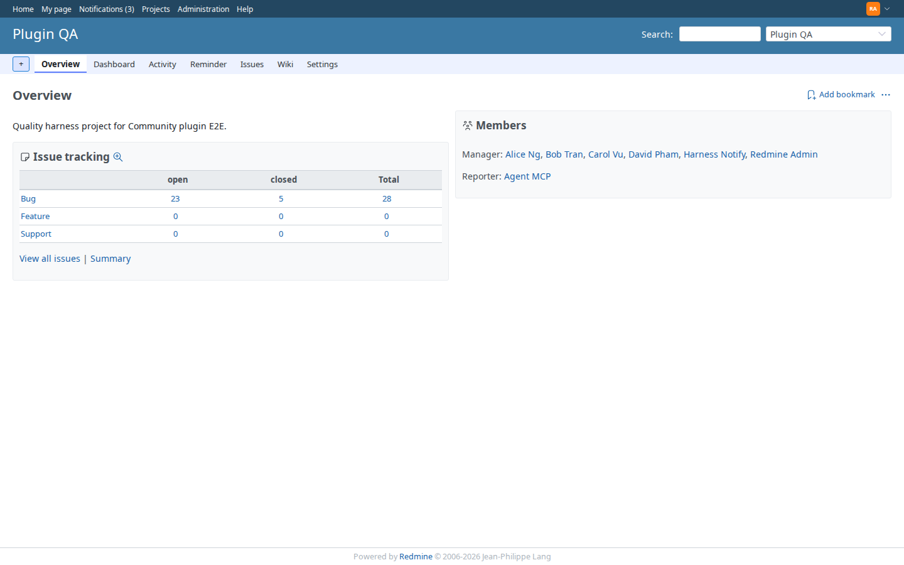
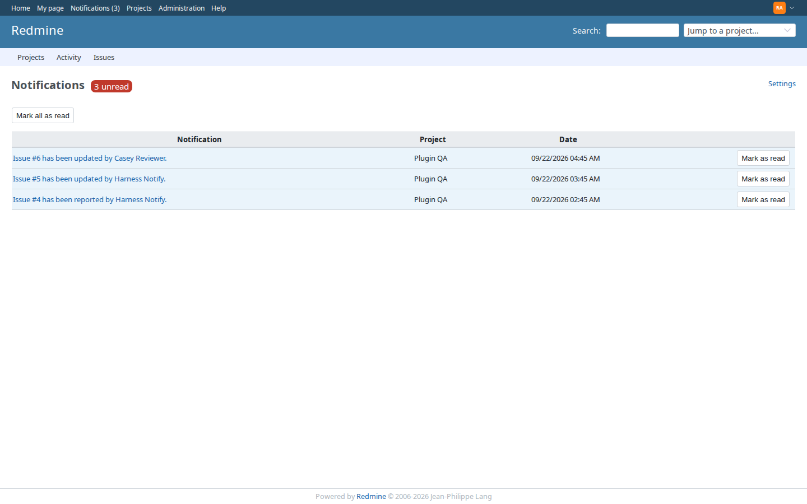
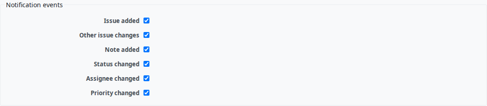
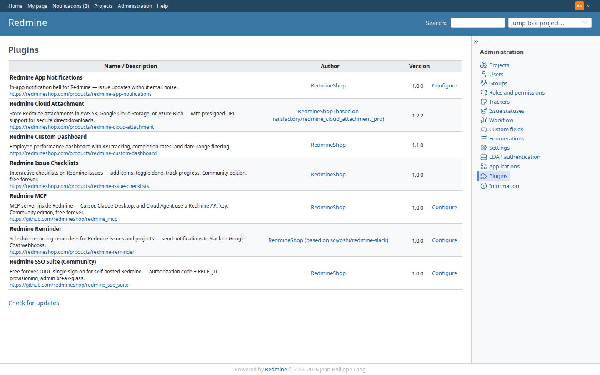

# Redmine App Notifications

[](https://redmineshop.com/products/redmine-app-notifications)
[](https://github.com/redmineshop/redmine_app_notifications/actions/workflows/ci.yml)
[](LICENSE)
[](https://github.com/redmineshop/redmine_app_notifications/actions/workflows/ci.yml)

**Last maintained:** 2026-10-05

**Source on GitHub:** [github.com/redmineshop/redmine_app_notifications](https://github.com/redmineshop/redmine_app_notifications)

In-app notification feed for Redmine. Issue activity appears in a **Notifications** top-menu entry with an unread count, so users can catch up without living in email.

Community edition is free forever: no license key, and no email address required to clone.

## Features

- **Notifications** entry in the Redmine top menu with an unread count
- In-app feed for issue create, update, note, status, assignee, and priority (each event can be turned off)
- Mark one notification read, or mark all visible notifications read
- The feed, the unread count, and mark-all include only issues the current user can see, including private issues and private projects
- Private notes are not delivered or shown to users who cannot view them
- Per-user toggle under **My account** (default on)
- Optional email fallback via a cron rake task (admin setting)
- Admin settings use standard Redmine tabular forms
- No external realtime service

## Requirements

- Redmine 5.0 or newer (`requires_redmine version_or_higher: '5.0'`)
- Ruby is the version shipped with that Redmine release. Public CI uses the official `redmine:7.0.1` image
- The database Redmine is using. Public CI uses SQLite

## Installation

Clone into `plugins/redmine_app_notifications` (the folder name must match):

```bash
cd /path/to/redmine/plugins
git clone https://github.com/redmineshop/redmine_app_notifications.git
ls redmine_app_notifications/init.rb
```

Do not rename the plugin directory. If you download a GitHub ZIP, rename the unpacked `redmine_app_notifications-main` folder to `redmine_app_notifications`.

### Migrate and restart

```bash
cd /path/to/redmine
RAILS_ENV=production bundle exec rake redmine:plugins:migrate NAME=redmine_app_notifications
# then restart Redmine (systemd, Puma, or docker compose restart)
```

Docker:

```bash
docker exec -e RAILS_ENV=production YOUR_REDMINE_CONTAINER \
  bundle exec rake redmine:plugins:migrate NAME=redmine_app_notifications
docker restart YOUR_REDMINE_CONTAINER
```

No extra gems.

### Enable per user

Users can enable or disable in-app notifications under **My account**. The default is on.

See the [Community install guide](https://redmineshop.com/docs/install) for Docker notes shared with the other free plugins.

## Configuration

**Administration → Plugins → Redmine App Notifications → Configure**

- **Notification events** — enable or disable in-app notifications per event:
  - Issue added
  - Issue updated (other changes)
  - Issue note added
  - Issue status updated
  - Assignee updated
  - Priority updated
- **Enable email fallback** — when on, run periodically:

```bash
bundle exec rake redmine:app_notifications:email_fallback RAILS_ENV=production
```

This emails unread in-app items older than 24 hours, one plain-text digest per recipient. Rows stay unread, so a later run includes them again until someone marks them read. Recipients who can no longer see the issue, and private notes they cannot read, are skipped. MiniTest covers that rake task.

## Uninstall

```bash
cd /path/to/redmine
RAILS_ENV=production bundle exec rake redmine:plugins:migrate NAME=redmine_app_notifications VERSION=0
```

Remove `plugins/redmine_app_notifications` and restart Redmine. Rolling back the migration deletes all in-app notification rows.

## Compatibility

`init.rb` sets `requires_redmine version_or_higher: '5.0'`, so 5.0 and newer are declared. Verified means public CI booted that Redmine version, installed this plugin, ran its migrations, and ran the MiniTest suite. MySQL and PostgreSQL are not part of that job. SQLite is what the official image uses in CI.

| Redmine | Declared | Verified |
|---------|----------|----------|
| 5.0.x   | Yes      | No |
| 5.1.x   | Yes      | No |
| 6.0.x   | Yes      | No |
| 6.1.x   | Yes      | No |
| 7.0.1   | Yes      | Yes — official `redmine:7.0.1` image (Ruby 4.0.7, Rails 8.1.3.1), SQLite, via `test/run-redmine-7.0.1.sh`: 77 runs, 343 assertions, 0 failures, 0 errors, 0 skips |

Other 7.0 patch releases were not run.

## Screenshot

Logged-in Redmine. Notifications is an entry in the top menu (unread count included).



The feed is a page, not a dropdown. The sample rows are an issue report, a note, and an assignment. This plugin has no separate mention or reminder event type.



Which events create an in-app item:





These screenshots were not regenerated for the 7.0.1 CI job.

## Tests

MiniTest lives under `test/`. It covers:

- Notification rows from issue create, note, status, assignee, priority, and other updates, including when an event setting is off
- Per-user opt-out under My account, and the default of on
- Unread count
- Mark one read and mark all read, limited to the current user's visible rows
- Private projects, private issues, and private notes
- The email fallback rake task (setting off, 24 hour cutoff, one digest per recipient, hidden issues skipped)
- Feed authorization, POST-only mark-read routes, a missing authenticity token, and HTML escaping of author, project, issue subject, and note text

Public CI (`.github/workflows/ci.yml`) boots official `redmine:7.0.1`, installs this plugin, runs migrations, and runs that suite. Ruby syntax (`ruby -c` on Ruby 3.2) is a separate job.

```bash
bash test/run-redmine-7.0.1.sh
```

On a Redmine install that already has this plugin migrated:

```bash
bundle exec rake redmine:plugins:test NAME=redmine_app_notifications RAILS_ENV=test
```

This repository does not include a browser end-to-end run. The screenshots above were not regenerated for the 7.0.1 CI job. Install the plugin on your own Redmine with the steps in [Installation](#installation).

## Community support

Async only: [GitHub issues](https://github.com/redmineshop/redmine_app_notifications/issues) or the [support form](https://redmineshop.com/support). No 24/7 SLA.

## License

MIT License. See [LICENSE](LICENSE). Originally based on [MichalVanzura/redmine_app_notifications](https://github.com/MichalVanzura/redmine_app_notifications), updated for Redmine 5.x and later and maintained by RedmineShop. No email required to get the plugin.
